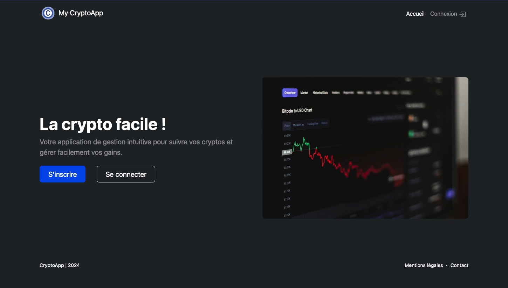

# Application Web / My Crypto App

Consulter sur : <http://sc4foal9574.universe.wf/crypto-app/>

L'objectif est de réaliser une application Web de suivi de cryptomonnaies

## Les fonctionnalités principales

* Inscription/Connexion
* Interface Back-End pour gérer les Utilisateurs enregistrés par l'ADMIN
* Gestion du compte Utilisateur (modification des infos / ajout image Avatar / Suppression de son compte)
* Gestion des cryptomonnaies favorites (ajout sans rechargement de la page) depuis le compte Utilisateurs
* Affichage des cours des crypto / variation sur 24h / courbes de tendances sur les 24 dernières heures et vue "Trading View"
* Utilisation de l'API cryptocompare.com

## Déploiement sur serveur Apache (PHP 8.2)

1- Ouvrir une liaison FTP avec le serveur distant et copier le contenu des fichiers (sauf node_modules)
2- Utiliser les scripts SQL fournis afin de créer la BDD, et les tables
3- Modifier le Password du compte ADMIN
5- Ouvrir le fichier db_config.php et actualiser les paramètres de la liaison à la BDD (voir avec votre hébergeur)
